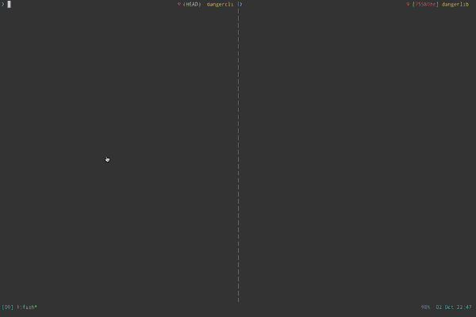

This project is deprecated and unmaintained. Proceed with caution!

dangercli - a cli for the Go [dangerlib][] package
==================================================
[dangerlib]: https://github.com/ciarand/dangerlib



Note
----
This is dangerous. Don't run it for anything other than fun, and be aware of
what you're doing. This library can and does execute provided commands with no
escaping or argument checking or anything fancy. Just like a regular CLI, if you
pass in a `rm ~/important/files/go/here/super/important/file.important` it will
remove it.

You have been warned.

Installation
------------
```bash
# This assumes that your $GOPATH is correctly setup:
go get github.com/ciarand/dangercli
```

Usage
-----
```bash
# Note, you'll need two shells open, one for the client and one for the server
# This also assumes that your Go bin is in your path

# In the first shell
dangercli server

# In the second shell
dangercli echo "this is my command"
```

[License][mit]
--------------
The MIT License (MIT)

Copyright (c) 2013 Ciaran Downey <code@ciarand.me>

Permission is hereby granted, free of charge, to any person obtaining a copy of
this software and associated documentation files (the "Software"), to deal in
the Software without restriction, including without limitation the rights to
use, copy, modify, merge, publish, distribute, sublicense, and/or sell copies of
the Software, and to permit persons to whom the Software is furnished to do so,
subject to the following conditions:

The above copyright notice and this permission notice shall be included in all
copies or substantial portions of the Software.

THE SOFTWARE IS PROVIDED "AS IS", WITHOUT WARRANTY OF ANY KIND, EXPRESS OR
IMPLIED, INCLUDING BUT NOT LIMITED TO THE WARRANTIES OF MERCHANTABILITY, FITNESS
FOR A PARTICULAR PURPOSE AND NONINFRINGEMENT. IN NO EVENT SHALL THE AUTHORS OR
COPYRIGHT HOLDERS BE LIABLE FOR ANY CLAIM, DAMAGES OR OTHER LIABILITY, WHETHER
IN AN ACTION OF CONTRACT, TORT OR OTHERWISE, ARISING FROM, OUT OF OR IN
CONNECTION WITH THE SOFTWARE OR THE USE OR OTHER DEALINGS IN THE SOFTWARE.

[mit]: http://mit.ciarand.me
